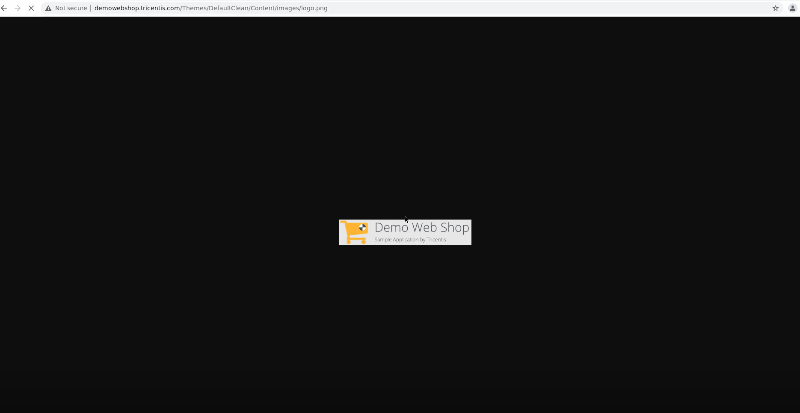

# The test automation project for Mobile testing

The project presents examples and approaches to Mobile testing.
In [Allure Report](#allure-report) you can find autotests for GET and POST requests, watch how they look without logs, with various options for logs, specifications and models.


___

## The project is done with the following technologies:

<p  align="center"

<code>


</code>
</p>


___

## Run tests from terminal locally

### Run tests on Browserstack:

```bash
gradle clean test -DdeviceHost=browserstack_android
```

### Run tests on Selenoid:

```bash
gradle clean test -DdeviceHost=selenoid_android
```

### Run tests on Appium emulator (with filled emulator.properties):

```bash
gradle clean test -DdeviceHost=emulator
```

### Run tests on Real device (with filled real.properties):

```bash
gradle clean test -DdeviceHost=local
```

### Serve report:

```bash
allure serve build/allure-results
```

## API tests for [reqres.in](https://reqres.in/):

Contains the tests for GET and POST requests. These are the tests which check these 'handlers' functionality. They are created with special specification.
You may look them in Allure as Suit 'ApiRequestsTest':

<p align="center">
  
</p>

___

### Run tests remote with parameters:

where:
> + ALLURE_NOTIFICATIONS_VERSION - select Allure notification version. By default - 2.2.3
> + COMMENT - you may write any understandable for text, which you'll see in telegram notification
> > + DEVICE_FARM - environment, where build will be run:
>   * `selenoid_android` - run tests on 'https://selenoid.autotests.cloud/wd/hub'
>   * `browserstack_android` - run tests on Browserstack

<p align="center">
  
</p>


## Results analysis

The test results can be found in:
+ [Jenkins](#jenkins)
+ [Allure Report](#allure-report)
+ [Allure TestOps](#allure-testOps)
+ [Jira](#jira)


### [Jenkins](https://jenkins.autotests.cloud/job/09-elenakomarova-lesson-mobile/)

Once the launch is finished you may watch statistics and open the `Allure Report` 

<p align="center">
  
</p>

### Allure Report

Here are the examples of a report about test build with grouping by suits.

The launch with results on Selenoid.

<p align="center">
  
</p>


The launch with results on Browserstack.

<p align="center">
  
</p>

### Allure TestOps

Allure TestOps is used as a storage for all tests cases (automated and manual), launches, their results. You may watch statistic and reports by all launches and results

:arrow_right: Dashboards:

<p align="center">
  
</p>

<p align="center">
  
</p>

<p align="center">
  
</p>

<p align="center">
  
</p>

:arrow_right: List of launches:

<p align="center">
  
</p>

:arrow_right: List of tests grouped by features and their history of launches:

<p align="center">
  
</p>

### Jira

Also Jira integration is implemented in the project:

<p align="center">
  
</p>


___

## Example of video with test running in Allure Report

You may see the example of a video showing the mix rest and ui test run in Allure report.

<p align="center">
  
</p>


___

## Notifications in Telegram channel

The project is configured to send notifications about the results of launches from Jenkins to Telegram channel

<p align="center">
  
</p>

___
